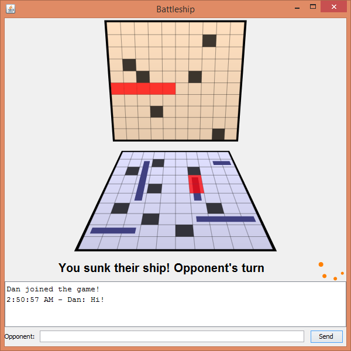

# BattleShip

Made for the 3rd semester Java course at SAIT, ITSD program.

## Building

You can build the project using Gradle. Tested with Gradle 2.1.

    $ gradle :jar

There are no extra dependencies, so you can also import the source files into
Eclipse or Netbeans if you prefer.
